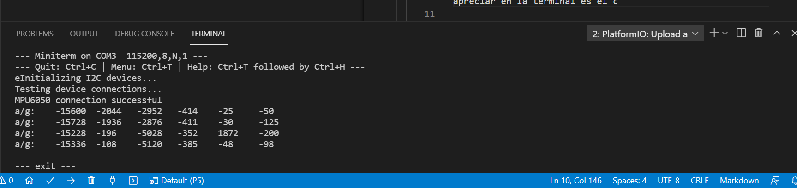

# PRACTICA 5 
### PARTE 1:
Siguiendo la programacion que se nos proporciona para realizar la practica primero nos encontramos con la declaracion del objeto MPU6050 a traves de la biblioteca para poder llevar a cabo correctamente todas las funciones posteriores y hacer la lectura de los datos captados por el componente, seguido a este encontramos la declaracion de las variables de tipo int16_t una usada para medir los 3 ejes de la aceleracion (ax,ay,az) y la otra para medir la velocidad angular (gx,gy,gz). Seguidamente encontramos la definicion del OUTPUT_READABLE_APCCELGYRO que se usa para enviar los 6 datos que tenemos en las otras variables, seguido de la definicion de un led en el pin 13 y un estado de parpadeo de este led en estado falso, es decir apagado.
Posteriormente nos encontramos el setup donde nos encontramos la definicion a traves del conjunto if elif donde el primero, es decir el if, tine como condicion que si se detecta el i2cdev_implementation es igual al i2cdev_arduino_wire, esto lo que hace es unirlo con el bus del I2C ya que la libreria de I2Cdev no lo ejecita de forma automatica, si se cumple la condicion del if se ejecutara el comando wire.begin() cuyo objetivo es iniciar la libreria Wire y conectarla al bus del ESP32 de modo maestro ya que a este no se le especifica la dirección. Por otra parte si no se cumple la condicion pasara a comprobar el siguiente if puesto con la condicion de si el i2cdev_implementation es igual al i2cdev_builtin_fastwire para posteriormente configurar este fastwire a traves del comando Fastwire::setup(400,true); con el mismo objetivo que el anterior unir el bus I2C, posteriormente a este conjunto descrito de if elif una vez cerrado nos encontramos con el serial.begin a la misma velocidad que la que encontramos en el monitor_speed ya que este es el que se encarga de la inializacion del monitor serie, despues de esta inalizacion del monitor nos encontramos un print a la terminal/monitor donde se nos informa que el dispositivo I2C esta iniciandose para posteriormente iniciarlo con el comando accelgyro.initialize();, una vez iniciado este se comprueba que sus conexiones sean correctas, por ello se nos muestra a traves de un print que el test de las conexiones se esta llevando a cabo para posteriormente mostrarnos a traves de un print el cual tiene dentro una condicion a traves del comando accelgyro.testConnection()? el cual le retornara internamentre un true o false i segun cual sea el el retorno interno de este se nos mostrara el mensaje por la terminal/monitor de este pint como la conexion del MPU6050 a sido exsitosa o la conexion del MPU6050 a sido fallida. Para finalizar este bloque, es decir el setup del programa, nos encontramos la definicion del estado de modo del pin donde se encuntra la led como una salida a traves del comando: pinMode(LED_PIN, OUTPUT);
Por ultimo nos encontramos el bloque del loop el cual sera ejecutado de manera continua hasta que finalicemos nosotros el programa, en este lo primero que encontramos es la lectura de las medidas del componente a traves de las variables ya definidas anteriormente a traves del comando accelgyro.getMotion6(&ax, &ay, &az, &gx, &gy, &gz); el cual es el que nos coje esta informacion del componente y las guarda los datos en la variables con el orden asignado, seguidamente nos econtramos con dos ifdef que tienen condicion comprobar si aquello que se le pide esta definido o no, el primero de ellos y el cual es el usado ya que lo hemos definido posteriormente es el que tiene como condicion la difinicion OUTPUT_READABLE_ACCELGYRO la cual si se cumple ejecutara el seguido de prints los cuales se encuentan el interior de este if, en primer lugar nos encontramos con el delay de 1000 que más o menos equivale a 1s para que a si al ser un bucle infinito las muestras de los valores obtenidos a traves del componente, ax, ay, az, gx , gy, gz seas leeibles a traves de la terminal/monitor, estos datos seran mostrados todos en una misma frase, es decir el print de "\t" equivale a dejar un espacio más grande que el introducido por teclado en la terminal/monitor. El siguiente ifdef que comprueba la si la definicion de OUTPUT_BINARY_ACCELGYRO se a llevado a cabo en nuestro programa no se a llevado acabo por tanto no comentare lo que se encuentra en ella ya que no lo hemos puesto en practica, por ultimo para finalicar el bloque loop y el programa nos encontramos la asignacion de cambio de estado del blinkState por su contrario, es decir como ya he mencionado con anterioridad en el antes del bloque setup donde habiamos declarado esta variable estaba apagada, es decir su valor era false, pues ahora le asignamos su contrario es decir verdadero por lo tanto se encontrara encendido, para posteriormente a traves del comando digitalWrite(LED_PIN, blinkState); hacer que la led que conectemos en el pin 13 nos muestre el de forma continua la funcion blinkState, es decir que se apage y encienda cada 1s, es una manera de comprobar que el programa se esta ejecutando y mientras esta este haciendo la funcion blinkState y nosotros la podamos observar de forma visual a traves del componente y no solo a traves de la terminal/monitor.
Una vez explicado el funcionamiento del programa podemos describir la salida de este, en este caso lo que podemos apreciar en la terminal es primero la frase que nos informa que el dispsitivo I2C se esta iniciando, posteriormente se nos informa que el el test de las conexiones de este se esta llevando a cabo seguido de si la conexion a este componente se a llevado a cabo de forma correcta o si por otra parte a sido fallida, para finalizar se nos mostrara la parte que se repitira de forma infinita mosotrandonos infinitas frases con la misma palabra al principio la cual es a/g junto al posterior conjunto de 6 numeros cada segundo los cuales varian de valor si yo muevo el componente ya que se trata de un accelerometro y se nos mostraran los valores de los distintos ejes. Captura del terminal/monitor demostrando lo que podemos observar a traves de la ejecucion de este programa una vez montado: 

